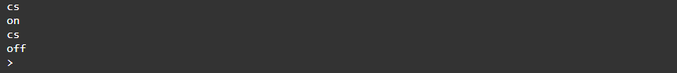

<div style = "font-family: 'Open Sans', sans-serif; font-size: 16px">

# ModuleBistableButton

<div style = "color: #555">
    <p align="center">
    
    </p>
</div>

## Лицензия

<div style = "color: #555">
В разработке
</div>

## Описание
<div style = "color: #555">

Модуль предназначен для работы с бистабильными цифровыми кнопками в рамках фреймворка EcoLite. Модуль разработан в соответствии с нотацией архитектуры датчиков и является потомком класса [ClassSensor](https://github.com/Konkery/ModuleSensorArchitecture/blob/main/README.md). Взаимодействие осуществляется через 0-й канал. 

Особенность бистабильной кнопки заключается в том, что при клике она изменяет свое состояние и сохраняет его до следующего клика. 

В контексте EcoLite бистабильная кнопка является гибридом, в котором основное устройство - датчик. Поэтому использование данного модуля предусматривается только с применением цветовой индикации (кнопки со светодиодом).

</div>

## Конструктор
<div style = "color: #555">

Конструктор принимает данные из конфига. Пример ниже:
```json
"17": {
    "pins": ["P11"],
    "name": "DigitalLed",
    "article": "",
    "type": "actuator",
    "channelNames": ["light"],
    "typeInSignals": ["digital"],
    "quantityChannel": 1,
    "busTypes": [],
    "manufacturingData": {},
    "modules": ["ModuleDigitalLed.min.js"]
},
"18": {
    "pins": ["A3"],
    "subDevice": ["17"],
    "defaultState": 1,  // 0 - вкл, 1 - выкл
    "name": "BistableButton",
    "article": "",
    "type": "hybrid",   // Обратите внимание!
    "channelNames": ["press"],
    "typeInSignal": "analog",
    "typeOutSignal": "digital",
    "quantityChannel": 1,
    "busTypes": [],
    "manufacturingData": {},
    "modules": ["ModuleBistableButton.min.js"]
}
```
</div>

### Поля
<div style = "color: #555">

- <mark style="background-color: lightblue">_Led</mark> - ссылка на исполнительный канал Led индикатора на кнопке;
- <mark style="background-color: lightblue">_DefaultState</mark> - статус кнопки при запуске;
- <mark style="background-color: lightblue">_Debounce</mark> - "антидребезг" при мониторинге кнопки.

</div>

### Методы
<div style = "color: #555">

- <mark style="background-color: lightblue">Start()</mark> - запускает мониторинг состояния кнопки;
- <mark style="background-color: lightblue">Stop()</mark> - прекращает мониторинг состояния кнопки.
</div>

### События
<div style = "color: #555">

- <mark style="background-color: lightblue">enable</mark> - включение;
- <mark style="background-color: lightblue">disable</mark> - выключение;
- <mark style="background-color: lightblue">changeState</mark> - смена состояния;
</div>

### Возвращаемые данные
<div style = "color: #555">
Как датчик модуль предоставляет данные о состоянии кнопки: 0-вкл, 1-выкл.
</div>

### Примеры
#### События enable, disable, changeState
<div style = "color: #555">

```js
let btn = SensorManager.CreateDevice('18')[0];
btn.Start();

btn.on('enable',      () => { print('on'); });
btn.on('disable',     () => { print('off'); });
btn.on('changeState', () => { print('change state'); });

// Теперь кликнем по кнопке
```

Результат выполнения:
<div align='left'>
    
</div>

</div>

### Зависимости
<div style = "color: #555">

</div>

</div>
